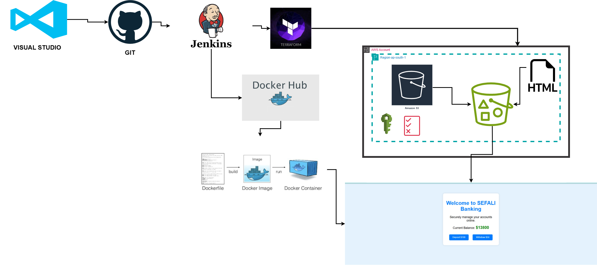

# Banking App Deployment

This project automates the deployment of a Banking Web Application using Terraform, Docker, and Jenkins.
It provisions infrastructure on AWS, builds a containerized application, and deploys it efficiently.

## Architecture Diagram




## Prerequisites
- **AWS Account** with access to S3
- **Jenkins** installed and configured
- **Terraform** installed (latest version recommended)
- **Docker** installed and configured
- **GitHub** repository with application code
- **AWS IAM credentials** configured in Jenkins
- **Docker Hub account** for storing container images

## Table of Contents
1. [Features](#features)
2. [Technologies Used](#technologies-used)
3. [Project Structure](#project-structure)
4. [File Links](#file-links)
5. [Walkthrough](#walkthrough)
6. [Deployment Steps](#deployment-steps)
7. [Animated Banking App Interface](#animated-banking-app-interface)
8. [Conclusion](#conclusion)

## Features
- **Automated Deployment:** Fully automated using Jenkins CI/CD pipeline.
- **Infrastructure as Code:** Terraform provisions AWS resources [S3]
- **Containerized Application:** Docker builds and deploys the banking app.
- **Cloud Hosting:** Application hosted on AWS S3 for static content.
- **Scalable & Secure:** AWS best practices for high availability and security.

## Technologies Used
- **Jenkins** - CI/CD automation
- **Terraform** - Infrastructure provisioning
- **Docker** - Containerization
- **AWS S3** - Hosting static content
- **GitHub** - Version control

## Project Structure

```bash
.
├── backend.tf       # Terraform backend configuration
├── Dockerfile       # Defines the Docker image for the banking app
├── index.html       # Frontend static content for banking app
├── Jenkinsfile      # CI/CD pipeline automation
├── main.tf          # Terraform resources ( S3)
├── provider.tf      # Configures Terraform provider (AWS)
├── variable.tf      # Terraform variables
```

### File Links
- [backend.tf](backend.tf)
- [Dockerfile](Dockerfile)
- [index.html](index.html)
- [Jenkinsfile](Jenkinsfile)
- [main.tf](main.tf)
- [provider.tf](provider.tf)
- [variable.tf](variable.tf)

## Walkthrough

### Automated CI/CD Pipeline (Jenkins)
1. **Infrastructure Provisioning:**
   - Jenkins fetches the Terraform code and runs `terraform init`, `terraform plan`, and `terraform apply` to provision AWS resources (S3).
   
2. **Building the Application:**
   - Jenkins retrieves the application code, builds the container image using Docker, and pushes it to Docker Hub.
   
3. **Deployment:**
   - Jenkins deploys the containerized application to the Terraform-provisioned EC2 instance and ensures it's accessible.

## Deployment Steps
1. Clone the repository:
   ```sh
   git clone https://github.com/your-repo/banking-app.git
   cd banking-app
   ```
2. Push your changes to trigger the Jenkins pipeline.
3. After deployment, access the application at:
   ```sh
   http://sefali-banking-app-3a04c331.s3-website.ap-south-1.amazonaws.com
   ```

## Animated Banking App Interface
### Preview the Animation


[View Live Banking App](http://sefali-banking-app-3a04c331.s3-website.ap-south-1.amazonaws.com)

## Conclusion
This project provides a fully automated deployment of a banking application using Jenkins, Terraform, Docker, and AWS. 

